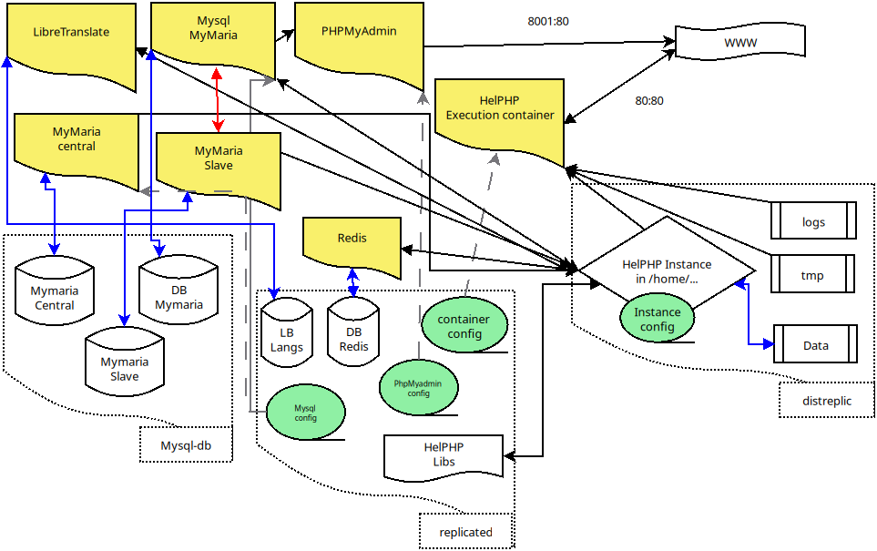

# Introduction

Après l'installation [Docker](https://github.com/INRAI-helPHP/helPHP-env-install/tree/Docker), et l'installation [Compose](https://github.com/INRAI-helPHP/helPHP-env-install/tree/Compose) qui fonctionnent sur seulement un ordinateur, nous devrions étudier un environnement cloud/cluster enfin.
Mais avant cela il y a un cas spécial que nous devons vérifier avec Compose : 
Une pile composer avec plusieurs serveurs mysql. 

Pourquoi ?

La redondance des données est maintenant un principe dans la création d'app (Haute Disponibilité) : Vous devez sauvegarder vos données, mais aussi être capable de les distribuer même si un de vos serveurs de données est hors service.
Donc d'abord nous devons prendre soin des données persistantes, il y en a deux types : Fichiers et Bases de données.

Pour les fichiers, selon le stockage utilisé, il n'y a pas de réel impact sur le dev de l'app, parce que du point de vue FS, un stockage monté est identique à autre un stockage monté quelque soit le filesystem (le plus souvent). Il peut y avoir quelques différences pour le calcul de taille de bloc, performance ou problèmes de streaming, mais rien qu'une bonne lib helPHP ne puisse résoudre ;) .

Pour la base de données, même si HelPHP offre une lib DB qui supporte nativement les serveurs maître/esclave plus un serveur db utilisateur centralisé, vous devez encore tester comment votre programme réagit dans ce cas, et basculer la cible de l'objet DB selon ce que vous faites (je modifie un utilisateur ? j'utilise l'objet db DB_CENTRAL, autre chose ? $DB) ...

La DB centralisée (DB_CENTRAL), est utilisée quand vous construisez plusieurs services/applications, mais que vous voulez vous connecter via des comptes utilisateur/groupe mutualisés. (vous pouvez utiliser un système d'auth externe, mais c'est en général plus sécurisé de compter sur un interne, et il n'est pas interdit d'établir automatiquement la connexion avec l'interne en se connectant avec l'externe... Double sécurité ;) ).

Donc nous aurons besoin d'une petite pile "composer" avec trois serveurs MySQL pour faire quelques tests. (si tout va bien, cela devrait fonctionner au minimum comme la solution serveur MySQL unique, avec de vrais serveurs vous devriez obtenir 2x plus de vitesse sur les opérations de lecture).

## Continuons...
Dans la branche précédente pour [Compose](https://github.com/INRAI-helPHP/helPHP-env-install/tree/Compose), nous avons fini une pile avec un serveur MySQL, nous devrions utiliser la même pile et faire quelques changements.

- 1 git clone cette branche quelque part :
```
git clone -b Compose-multi-mysql https://github.com/INRAI-helPHP/helPHP-env-install
```

vous trouverez à l'intérieur les fichiers précédents de la branche Compose et quelques nouveaux fichiers utiles...

- 2 ajouter quelques dossiers :

Donc nous aurons besoin d'ajouter quelques dossiers pour tous ces services :

rappelez-vous, dans /mnt/ nous avons replicated , myslq-db et distreplic (si vous avez utilisé le script n°1).

Si ce n'est pas déjà fait, copiez HelPHP :

```
mkdir /mnt/replicated/helphp
git clone https://github.com/INRAI-helPHP/helPHP.git /mnt/replicated/helphp
chown -R your_docker_username:users /mnt/replicated/helphp
```

nous allons créer un serveur MySQL nommé "mymaria" et basé sur une version classique de mariaDB .

donc sous votre utilisateur docker :

```
cd /mnt/
mkdir replicated/mymaria-slave \
mysql-db/mymaria-slave \
replicated/mymaria-central \
mysql-db/mymaria-central 
```

revenez dans le dossier helphp-env-install

```
cp confs/mysql-slave/my-init.cnf /mnt/replicated/mymaria-slave/ &&\
cp confs/mysql/my-init.cnf /mnt/replicated/mymaria-central/ &&\
cp compose-3-servers.yaml /mnt/replicated/
```

- 3 Éditez compose-3-servers.yaml

Avec nano ou n'importe quel éditeur de texte, éditez /mnt/replicated/compose-3-servers.yaml.

Comme pour la pile composer vous devez remplacer "YOUR.H.C.NAME" par le nom que vous avez donné quand vous avez lancé le script 2-add-container.sh.

Et remplacer "YOURPASSWORD" par un choisi pour chaque serveur MySQL

- 4 quelques infos sur cette pile :

vous verrez si vous comparez avec composer.yaml qu'il y a quelques différences : 
les deux premiers serveurs Mysql démarrent en cluster et ont un my_init.cnf différent.
Le slave est intéressant :

vous trouverez deux valeurs importantes :
server-id=2
auto_increment_increment = 2

server id pour faire la différence avec le master (id 1) et l'auto_increment au cas où nous inverserions l'ordre d'écriture ou créerions un cluster avec réplication double maître esclave (donc si les deux serveurs écrivent quelque chose, ils n'utiliseront pas le même id pour écrire simultanément), ou si le master est mort et nous devrions inverser l'écriture vers un nouveau serveur sql.

PhPmyadmin s'occupera des 3 serveurs MySQL maintenant.

- 5 Configuration HelPHP 

Deux cas possibles : 

1 - Vous n'avez pas encore installé HelPHP ? 
Donc quand avec votre navigateur vous accédez à votre serveur via son ip/domaine (ou localhost ou 127.0.0.1 si vous être en local) vous pourrez remplir le formulaire d'installation ...

2 - l'instance est déjà installée ? 
allez dans le dossier config (normalement dans le path ressemblant à "/mnt/distreplic/custhome/YOUR.H.C.NAME/default/config") de votre instance et éditez db.php pour modifier quelques constantes :
```
    const MASTER_SLAVE_MODE = true;
    const DB_SLAVE_HOST = 'mymaria-slave';
    const DB_SLAVE_USER = 'YOURUSER';
    const DB_SLAVE_BASE = 'YOURDB';
    const DB_SLAVE_PASS = 'YOURPASSWORD';
    
    const DB_CENTRAL = true;
    const DB_CENTRAL_HOST = 'mymaria-central';
    const DB_CENTRAL_USER = 'YOURUSER';
    const DB_CENTRAL_BASE = 'YOURDB';
    const DB_CENTRAL_PASS = 'YOURPASSWORD';  
```
bien sûr changez YOURUSER, YOURDB, YOURPASSWORD...

Puis ouvrez une session bash dans votre conteneur d'instance en cours d'exécution :
(tapez avant `docker ps` pour obtenir votre id de conteneur).
'docker exec -it yourcontainerid bash' 

Une fois connecté, cd dans /home/helphp/utils et lancez :

`php install_db_and_modules.php /HOMEOFYOURINSTANCE` (normalement /home/default si vous êtes encore avec l'exemple d'instance par défaut de la branche composer).

cela devrait lancer la réplication maître esclave et installer la db utilisateur dans mymaria-central. 

Enfin, avec phpmyadmin, copiez le contenu des tables 'group_data','group_users','users_address','users_connexions','users_data' du master/slave vers central, et votre instance devrait fonctionner exactement comme avant, mais en mode maître/esclave + DB centralisée. 

## Lancez-le !
Toujours en tant que votre utilisateur docker, d'abord arrêtez le compose précédent s'il est encore en cours :
`docker compose down`

puis lancez la nouvelle composition :
`docker compose -f compose-3-servers.yaml up`

allez dans votre navigateur et tapez l'adresse ip de votre serveur (localhost ou 127.0.0.1 si c'est votre ordinateur) pour commencer l'installation de l'instance helphp (si ce n'est pas déjà fait) ou ajoutez le port ":8001" pour accéder à phpmyadmin.

Vous devriez obtenir quelque chose qui fonctionne de manière fluide, avec presque aucune différence et qui peut encore fonctionner sur seulement une machine.

Et vous pouvez revenir au fichier compose.yaml précédent selon vos besoins.

Évolution de notre pile :



Maintenant si vous voulez expérimenter avec un stockage de fichiers partagé et la communication réseau dans un cluster/cloud pour compléter les autres besoins en haute disponibilité, vous aurez besoin d'au moins 2 serveurs ou 2 VM pour créer un docker [Swarm](https://github.com/INRAI-helPHP/helPHP-env-install/tree/Swarm) (3 si vous voulez essayer avec Kubernetes, mais pour docker Swarm 2 serveurs sont suffisants). 

Si vous avez seulement un seul PC pour l'expérimentation, jetez un œil sur VirtualBox, VMWare, Promox etc... il y a des tonnes de bons logiciels de virtualisation.
