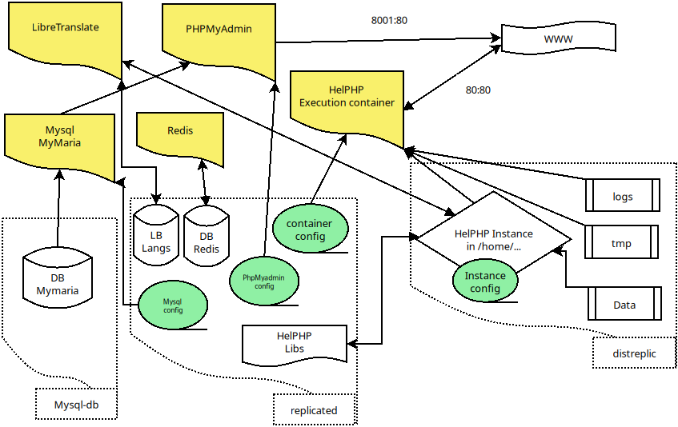

# Introduction

We have two ways for installing everything in this branch :

- 1 : you are in hurry ? No time to study ? 

Just copy paste this line in your server or VM terminal (worsk with recent Debian/Ubuntu/Mint distro) :

```
apt install -y git && \
git clone -b Composer https://github.com/INRAI-helPHP/helPHP-env-install && \
bash helPHP-env-install/one_line_install.sh
```
- 2 : you have 20 mins to study that ? 

please continue to read :

Before starting with composer, you need to install docker and make some folders etc...

Please check this branch before : [Docker](https://github.com/INRAI-helPHP/helPHP-env-install/tree/Docker) but don't launch the container.

We'll keep the same files and scripts from this previous branch as it's the same base.
So after using the script 2-add-container.sh please come back to this branch, we'll continue with composer ...

## Why composer ?

You are a developper ? or you just have one server on which you start to have multiple services and you want to control their ressources ? Composer is a good choice to keep things simple with good performances...

As it's already installed with docker, we can directly compose a "stack" of services, and launch it/stop it in one command. 

## Docker desktop under windows consideration :
You can use the composer stack with Docker desktop under windows, but to avoid issue, you should create all folders inside one folder, and inside this one put your yaml file. Like this you will be able to use relative paths (as writing absolute path can be difficult under windows).

Some filesystem operation are really slow under window, like calculate free disk space, or occupied space for a folder etc... We recommend to only use it for local dev.

## Let's continue...
In the previous branch for docker, we just launch a dedicated HelPHP instance execution Container (H.C to make it short), but alone it will miss a connexion to a MySQL server and if we want performances and scalability, a Redis server. and probably we will need another H.C for special project etc... 

And also, this, time we want  perhaps to add Libretranslate, and PhpMyadmin, why not ?

- 1 git clone this branch somewhere :
`git clone -b Composer https://github.com/INRAI-helPHP/helPHP-env-install`

you'll find inside the previous files of the Docker branch and some usefull new files...

- 2 add some folders :

So we'll need to add some folders for all this services :

remember, in /mnt/ we have replicated , myslq-db and distreplic (if you have already used script n°1).

If it's not already done add HelPHP :
```
mkdir /mnt/replicated/helphp
git clone https://github.com/INRAI-helPHP/helPHP.git /mnt/replicated/helphp
```

we will create a MySQL server named "mymaria" and based on a classic version of mariaDB .

so under your docker user :

```
cd /mnt/
mkdir replicated/redis \
replicated/pma \
replicated/mymaria \
mysql-db/mymaria 
```

cd back in the helphp-env-install folder

```
cp confs/mysql/my-init.cnf /mnt/replicated/mymaria/ &&\
cp confs/phpmyadmin/config.inc.php /mnt/replicated/pma/ &&\
cp compose.yaml /mnt/replicated/ &&\
cp -r confs/libretranslate /mnt/replicated/ &&\
chmod -R 777 /mnt/replicated/libretranslate &&\
cp compose.yaml /mnt/replicated/
```

- 3 Edit compose.yaml

With nano or any text editor, edit /mnt/replicated/compose.yaml.

Yes we've already made the job ! And you have very few things to do :

a composer stack is divided in services, the first one is corresponding exactly to the docker run we've done in the "Docker" branch, with same volume, same port, so you have to replace 
"YOUR.H.C.NAME" by the name you've given when you've launch the script 2-add-container.sh.

The second service is your first mysql server, and it will need a root password, so replace "YOURPASSWORD" by a choosen one !

- 4 some info about this stack :

you'll see that we mount my-init.cnf in mariadb, letting you adjust his parameters if needed.

same thing for the first service : phpmyadmin, with config.inc.php.

Important : we give the port number 8001 to phpmyadmin, so if your type your server ip + :8001 you'll get phpmyadmin (no port number for helphp instance, as it's redirected to 80).

The fourth service is redis, that will backup a little nosql file in replicated/redis to restart in case of crash with some session or process still alive.

The fifth one is libretranslate, it will start to download immediatly its lang packages, so it will not be operationnal until finished. Don't forget to generate a new API key (take a look at  their [documentation](https://docs.libretranslate.com/guides/manage_api_keys/) ) and add it in config/main.php in your helphp instance. (still in this config file, the url for libretranslate should be http://libretranslate:5000/)


## Launch it !
Still as your docker user, go to /mnt/replicated where is your compose.yaml file and launch :
`docker compose up --detach`
And enjoy !

Perhaps you'll need to setup user rights on helphp instance files if it's your first install : 
`docker exec -ti name_or_id_of_container chown -R www-data:users /home/default`

go to your navigator and type your server ip adress (localhost or 127.0.0.1 if it's your computer) to start helphp instance install or + ":8001" to go to phpmyadmin.


`docker compose down` to kill the stack.

And now we begin to have something that we can call "A simple stack" but with enough service division and little things done (like external config files in green in the schema bellow) for evolution ... 



You'll always have to think about how you'll manage you cpu, storage (and type of storage!), bandwith and memory needs, and how it will grow ! 

So scalabity and also high availability must be at start in the project plan.

From this point of view, the first thing targeted are long life data in database (short life data, like session, process following can be stored in mysql, but it's better to use a fast noSQL like redis for that, and those data are no essentials). 
Long life data are often stored in a SQL server type DB and this kind of server offer cluster or master/slave replication mecanism. 

hoppefuly with composer we can easily experiment that. 

Take a look at the [Composer multi MySQL](https://github.com/INRAI-helPHP/helPHP-env-install/tree/Composer-multi-mysql) branch. 


