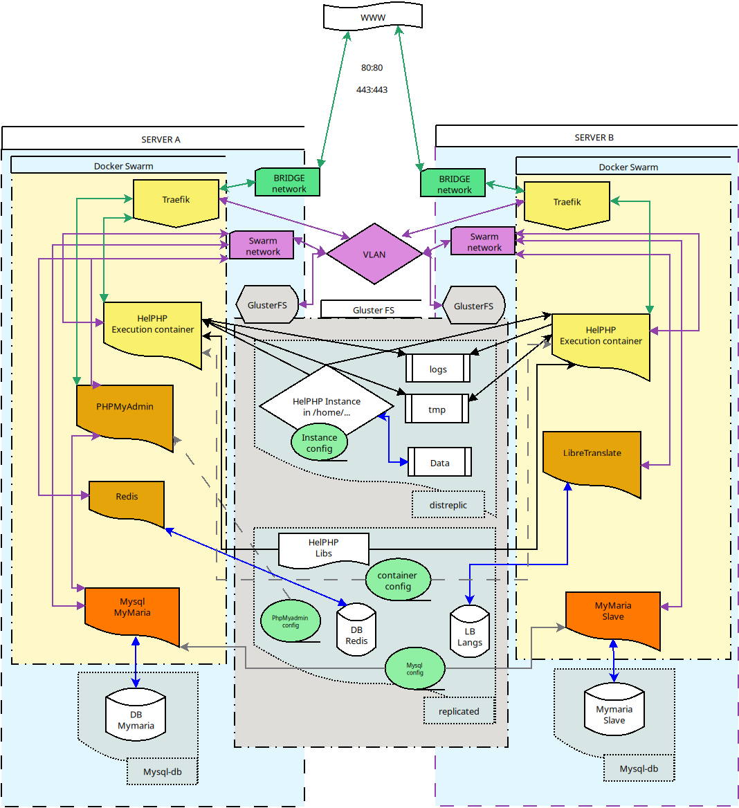

# helphp-env-install with Docker Swarm !

In this branch we'll meet ... THE SWAAAAARRRRMMM !!!!

Don't be afraid, the swarm is your friend !

When you install Docker, it comes with compose, but also with the swarm : If compose permit to manage multiple services on a server/VM, the swarm do the same on multiple server/VM and permit to create a real cloud with high availability, load balancing etc...

Why do we choose Docker swarm instead of Kubernetes ? There is few differences, but really, Swarm is more simple and consume less ressources.

KB is really for huge project with tons of servers and micro services, in general Docker Swarm is enough and can start with only two servers/VM, KB needs three. And if necessary you can migrate to KB later.

When we say Docker Swarm is more simple than KB, you will be able to appreciate that with this project, because we'll install the more simple cluster/cloud stack possible with minimum services and security and it already looks like that :



What the hell is this strange creature ?

## Understanding the architecture

- Communications :

In light blue you have our servers A and B, they have one or two network cards each. 

If your servers/VMs got two cards we can isolate internal communications with a Vlan and let only frontal services display/communication go thru the first one. 

That's really better to have two cards, because internal communications are not exposed thru public network, and your server bandwith for public network is not consumed by internal services.

On the schema, public transfers are in green and communicate thru a network set as bridge.
The violet links are for interval communitions and are just an interval Vlan, not exposed to public.

As there is two servers, if we want to attach a Domain to both, we'll need an external load balancer, or at least a DNS with round robin declaration of both servers.

- Storages :
in grey you have the storages :
You'll find again our replicated / distreplic / mysql-db folders but this time setuped as shared and replicated storage on both servers (except mysql-db) with gluster-FS.

Gluster fs can replicated a storage on all servers/vm or distribute data along a distributed strorage as blocks multiplied 2 or X times (so if you have 5 servers with 1Tb for distributed gluster FS, and you set 2 copy for blocks, you have in fact 2.5Tb available of storage).
So with GlusterFS, when you write something on server A, you'll find the same in server B.

But block storage are not made for mysql database, so they should be stored diferently.
Localy, with a data replication tru MariaDB mysql Master/Slave replication system.

- Services :
on each server we'll install docker Swarm, that will merge both servers ressources and permit to launch services on both servers depending the ressource available. But some services must be present on all servers, some not.

In strong orange, you have MariaDB servers, that will operate mysql operations on local mysql DB. And as they are local, the mysql services must be attached to the corresponding DB and so launched each time on the same server.

In light orange, some services that can lanched anywhere. Docker swarm will choose the better server to launch them depending available ressources (Phpmyadmin, Libretranslate, Redis)

In yellow, the services that should be available on all servers : Traefik for reverse proxy, balancing, security filtering etc, and our HelPHP execution container.

- Principles : 

if you request something to the HelPHP container on server A or B, the result is the same, because the database is replicated, but also the storage, and even the session managed by redis.

If you read/stream data by alternating requests to A/B, you simple double the transfer speed (in theory !)

If you write something in database, the speed is limited by server A who host the mysql master server.

If you upload a file, the speed can be doubled if you chunck it (the HelPHP API for FS lib offer this feature) and send two chunks at the same time.

If one server is off, the other one will take care of everything because the swarm will detect the death of one server  in his cluster and redistribute the services on the survivor.
In that case, if you have an external load balancer in front or your servers with fail detection, your services will continue to run as if nothing happened (just a little slower). If you use the round robin DNS trick, you'll have to remove dead server ip from it and it will do the same. 

If you need more ressources, add a server, make it join the swarm, expend your gluster storage, and that's it... and continue expand your creature... 

it's ALIVE !!! ALIVE !!! (huuuh sorry...)

## Ready ? Go to install this creature

- 0-0 : make some background job :

First connect to both servers/VM and sudo as root, cd to any folder you want and :

```
apt install git -y && git clone -b Swarm https://github.com/INRAI-helPHP/helPHP-env-install \
&& cd helPHP-env-install \
&& chmod 777 *.sh && chmod -R 777 confs/helphp-instance \
&& bash 0-0-background-sh
```

- 0-1 : Vlan setup 
If you have a secondary network card on each server just linked to a switch or a Vlan with no DHCP, we can create an internal network for communication with some fixed ip .

Please note that after this step when we speak about the internal network or ip, it will refer to the choosen ips during this step, or the ip of your unique network card (we will make run this creature even there is one network card).

So first we must discover the name of our network card :

`ip a ` will display the current network configuration with one card already connected with the ip you're using for terminal ssh connection and a secondary, please note its name and launch 

`./0-1-vlan.sh`

answer the first question with the name you've just note, and at the second enter an ip compatible with your Vlan or network, for example 168.168.2.1 on the first server and .2 on the second.

Normaly should be able to ping the other server/VM thru its ip (make sure it's ok before continuing)

we will modify /etc/hosts to associates those ips with name for communication between the two servers/VM, so :

`nano /etc/hosts`

and add the ip of the other server and a name like cluster-2
and after 127.0.0.1 add also a name to identify the current server.

you should get for the server something like this : 

```
127.0.0.1       localhost   cluster-1
192.168.2.2     cluster-2
# The following lines are desirable for IPv6 capable hosts
::1     localhost ip6-localhost ip6-loopback
ff02::1 ip6-allnodes
ff02::2 ip6-allrouters
```

so when we call a "cluster-X" server, the communication is only on internal network and not exposed to the web (depending how you create your network of course).

## storage replication 

Now, as we've finished the preparations, we must setup our storage replication for /mnt/replicated and /mnt/distreplic (not /mnt/mysql-db, because mariadb will user another mecanism to replicate it's data).

This time we'll use GlusterFS, simple and efficiant, it will answer to our three needs :
- we need the possibility to replicate on all server, or just with two copies over a HA storage
- it must be fast enough to follow our web service (it depends hardware mainly, but the speed of the software layer is important too).
- We want to setup quota on folders that can be used by our docker container to limit disk usage.

Ok for Gluster ! There is other solution of course (like Ceph node etc), and you should study those depending your project needs, of if you should use a NAS with nfs sharing etc... 

But this time, it's Gluster time !

- 1-1 : Starting the install 

First go the second server (cluster-2) connect as root and clone again (if it's not already done) this repository and launch first script :

```
git clone -b Swarm https://github.com/INRAI-helPHP/helPHP-env-install && \
cd helPHP-env-install && \
bash 1-1-gluster-B.sh
```
- 1-2 : Launching the replication 

Second, connect as root and cd to helphp-env-install on first server and :

`./1-2-gluster-A.sh`
At this stage it may be that gluster is not correctly initialized on some versions of debian.
In that case, we have to restart/clean gluster.
On all servers:
```
sudo systemctl stop glusterd
sudo rm -rf /var/lib/glusterd
sudo systemctl start glusterd
```
then restart the script `bash 1-2-gluster-A.sh`

- 1-3 : Fixing the new volumes in fstab 

It's already done on first server on previous script, but as the replication is launched, we need to fix the volumes on the second one.
so on second serveur cd to helphp-env-install and :

`./1-3-gluster-B.sh`

if you put something in /mnt/replicated or /mnt/distreplic you should find it on both machine.

Note that at this moment, as we have only two servers, the replica is set to 2 on both volumes, if you had more servers, for /mnt/replicated, the replica number must be the same as the number of servers, to replicate the block files on all server.
But for /mnt/distreplic you just need to let it at 2 (two copies are enough). 
Why this difference ?

when the services starts, they need their config files etc, so they must be available on all servers, and like that even if there is only one server left it should be capable to launch all services.
And the speed access to those config file is important so those files must be local everywhere.

/mnt/distreplic is for user/persistant Data, they can be on an NFS or any external storage, of thru a distributed storage, their speed access is less important, so we can retrieve them thru network, and with a correct distribution of the replicated blocks, there is very few chance of data lose.

Note : After a reboot, if you type `df` sometimes your gluster volumes doesn't appear, and it's enough to type `cd /mnt/replicated` to make it appear, so a little cron job at boot is sometimes necessary depending your config/distro.

## Docker and swarm

It's now time to make the swarm ALIIIVVEEEE (HHUUhuhuh sorry...)!

- 2-0 the docker user :

On both servers, as root, in helph-env-install, launch 

`./2-0-docker-user.sh` and answer same response on both. 

As soon as our docker user is created, will continue with it, so `su docker_username` 

- 3-0 the swarm install :

On first server, with your docker user launch `./3-0-swarm-A.sh` and indicate the internal IP of this server (or the unique ip you have if you have only one network card)

Your first server will become the first swarm manager, and in /mnt/replicated/ you'll find a new folder (swarm-tokens) with commands to make new servers join the swarm as worker or manager.

The first server is now a swarm manager but also a node in the swarm, so it will host services too, and the script give him a label : "mariadb-master" , this label will indicate on which server will be hosted and launch mariadb as master and its SQL data. of course, in the next step the second server will be labeled as slave. 

In case of crash, helPHP will rely on the surviving server (in general, but you can force the unique SQL survivor as main server in you instance config/db.php file if the automation is not enough).

So when you'll repair your cluster, don't forget to add/update/change the labels depending the situation.

- 3-1 join the swarm :

On second server, as docker user, launch `3-1-swarm-B.sh` .

It will go fetch the token in /mnt/replicated/swarm-tokens (thanks gluster !), make the second server join the swarm also as a manager (when there is very few servers, separating manager and workers is not really necessary), and be labelled as mariadb-slave !

We are now ready to launch our services, but some last preparations are necessary.

## Prepare the launch

- 4-0 some folders :

still as the docker user in helphp-env-install in the first server, just launch :

`./4-0-preparation.sh`

on the second server, still as the docker user do :

```
mkdir -p /mnt/mysql-db/mysql/maria-slave \
/mnt/mysql-db/logs/maria-slave

```

- 5-0 our HelPHP container : 

still as the docker user in helphp-env-install on any server, just launch :

`./5-0-add-container.sh` and indicate a name for the container.

And that's it ! a mainstack.yml file is now in /mnt/replicated and should be ready to launch

## launching

Before launch, take a look at /mnt/replicated/mainstack.yml :

This is your stack for the swarm, describing each service, conditions, and route managed by the reverse proxy traefik.

For the first start, it will not relay on a domain nor on on Https. 
Https config is commented and you should switch from "web" to "websecure" as soon as you have a domain. 

the rules for HelPHP container and phpmyadmin is simple, they will answer as soon as we request /helphp and /pma after the first or second server external ip or domain.

The stack is not totaly finished and perfect, you should buy a domain, or create a local dns with a fake domain to make some round robin dns redirection to both ips, add https support etc. 

Libretranslate is quite heavy, so you should disable it if your hardware configuration is light.

Anyway, we can already test it like that : 

`docker stack deploy -c /mnt/replicated/mainstack.yml hphp`

`docker service ls` will show when everything is ready and launched (the first time it needs to download the services images) and when ready, if you type one of your servers external ip (it should response on both) you should get the HelPHP install script . enjoy :)

Please note that if you can't connect/open a session with you container, in general it's an issue with redis, so check its logs (docker service logs hphp_redis).

Note again : If you have some permission issues on helPHP repo or your issue, you can use /mnt/replicated/helphp/utils/change-rights.sh .

Note again that if your using very little VM, you shall not launch libretranslate.

Now you should check the documentation on [helphp.org](helphp.org/install/helphp) about HelPHP install configuration, but at least , set in config/main.php the "CLUSTER" constant at "true", if you miss it during installation.
